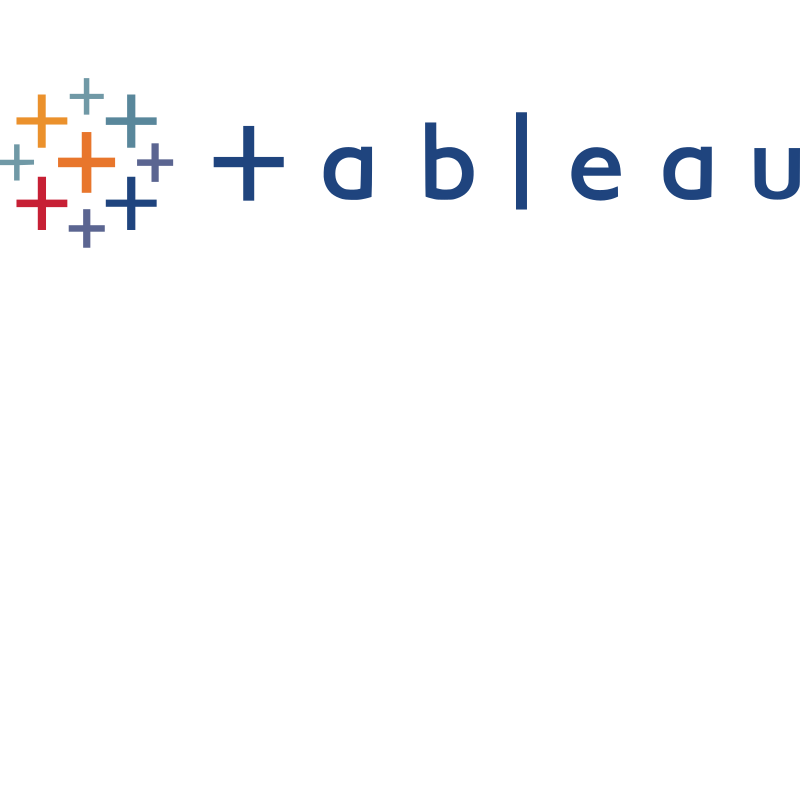

# Javier Santuy Muñoz

Hello! 👋 I’m a **Data Analyst** who loves digging into data like a detective 🕵️‍♂️ to figure out what's hidden. This approach helps me understand and solve real-world problems. I’ve been working on creating dashboards to highlight the key insights, using tools like BigQuery, Looker, and Jupyter Notebooks for my analysis.   

📚 **What You’ll Find in My Repository**

 - Data Analysis: Exploration and visualization of data using modern tools.
 - Web Scraping: Extracting data from websites for tailored analyses.
 - Data Science: Predictive modeling, data processing, and advanced analysis using Python.

 

 🛠️ **Tools and Technologies**
 

 
   
 
 ## 🌱 **My Goals**

To continuously learn and explore new technologies in the data analytics ecosystem.

To deepen my expertise in advanced Business Intelligence tools, Machine Learning, and statistical analysis techniques.

In the future, I aim to apply these skills in healthcare-related work environments, helping to solve complex challenges in the industry.

## 👋🏻 **Connect with Me:**

